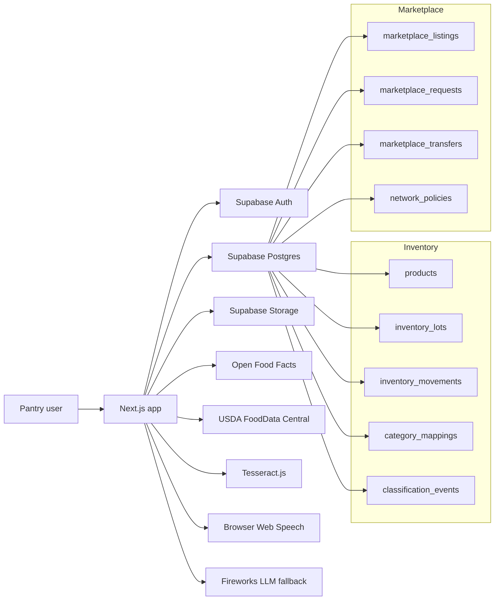
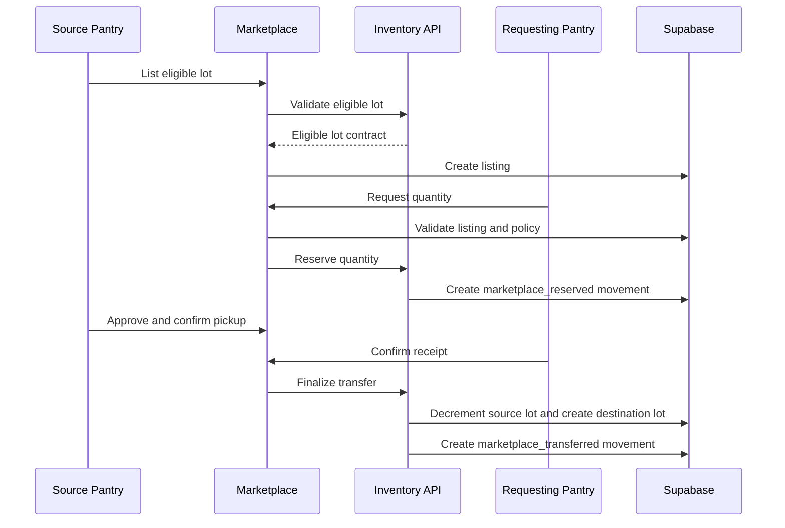

# Design: GoodCo Pantry Mesh

## Overview

GoodCo Pantry Mesh is a Bay Area web application for pantry inventory capture and pantry-to-pantry marketplace transfers. The application converts receiving events into reviewed inventory lots, then exposes eligible lots as marketplace listings that approved pantries can request and transfer.

The design follows Kiro's spec-driven flow: requirements define behavior, this design defines architecture, and tasks split implementation into a shared contract followed by two independent workstreams.

## Technology Stack

- App framework: Next.js with TypeScript
- Styling: Tailwind CSS
- Database: Supabase Postgres
- File storage: Supabase Storage
- Auth: Supabase Auth
- Barcode scan: `@zxing/browser`
- Product lookup: Open Food Facts API, then USDA FoodData Central API
- OCR: Tesseract.js for browser MVP
- Speech input: browser Web Speech API
- LLM fallback: Fireworks-hosted model with structured JSON outputs

Required environment variables are documented in `.env.example`.

## System Boundaries

### In Scope

- Approved pantry accounts
- Bay Area pantry profiles
- Real receiving events
- Real inventory lots
- Product lookup and categorization
- Date parsing through OCR/voice/manual input
- Persistent correction memory
- Marketplace listings created from inventory lots
- Marketplace requests, reservations, approvals, pickups, receipts, and transfers
- CSV export

### Out Of Scope

- Synthetic marketplace inventory
- Consumer-facing public shopping
- Driver dispatch
- Payment processing
- Full warehouse management system
- Real-time perfect SKU accuracy
- Formal endorsement by any food bank unless explicitly configured

## Architecture



## Shared Contract

The shared contract is the first implementation artifact. It defines TypeScript types, database tables, API route boundaries, and ownership between streams.

### Inventory Owns

- `products`
- `inventory_lots`
- `inventory_movements`
- `category_mappings`
- `classification_events`
- `extraction_jobs`
- eligible-lot query
- inventory reservation and final transfer mutation APIs

### Marketplace Owns

- `marketplace_listings`
- `marketplace_requests`
- `marketplace_transfers`
- `network_policies`
- browse/listing/request UI
- approval and transfer lifecycle UI

### Contract Types

```ts
export type PantryCategory =
  | "produce"
  | "dairy"
  | "eggs"
  | "meat"
  | "poultry"
  | "seafood"
  | "plant_protein"
  | "canned_meals"
  | "canned_vegetables"
  | "canned_fruit"
  | "canned_beans"
  | "grains_and_rice"
  | "pasta_and_noodles"
  | "cereal_and_breakfast"
  | "bread_and_bakery"
  | "snacks"
  | "beverages"
  | "baby_food"
  | "infant_formula"
  | "diapers_and_baby_supplies"
  | "hygiene"
  | "household"
  | "pet_food"
  | "prepared_meals"
  | "frozen_food"
  | "refrigerated_prepared_food"
  | "condiments_and_sauces"
  | "baking_goods"
  | "spices_and_seasonings"
  | "unknown";

export type StorageType =
  | "dry"
  | "refrigerated"
  | "frozen"
  | "ambient_short_shelf_life";

export type MarketplaceEligibleLot = {
  lotId: string;
  pantryId: string;
  productId: string;
  itemName: string;
  category: PantryCategory;
  subcategory?: string;
  quantityAvailable: number;
  unit: "each" | "case" | "box" | "lb" | "oz" | "gal";
  storageType: StorageType;
  bestBy?: string;
  expirationDate?: string;
  moveBy?: string;
  lotCode?: string;
  sourceType: "food_bank" | "retail_rescue" | "direct_donation" | "purchased" | "unknown";
  tefapFlag: boolean;
  redistributionAllowed: boolean;
  reviewStatus: "confirmed" | "needs_review";
  availabilityConfidence: "confirmed" | "likely" | "stale";
};
```

## Data Model

### Core Tables

- `pantries`: approved organizations and storage capabilities
- `products`: canonical product details and external category fields
- `inventory_lots`: actual pantry inventory
- `inventory_movements`: every inventory mutation
- `category_mappings`: persistent correction memory
- `classification_events`: categorization audit trail
- `extraction_jobs`: OCR/speech/LLM extraction audit
- `marketplace_listings`: visible marketplace supply
- `marketplace_requests`: requests/reservations against listings
- `marketplace_transfers`: completed handoffs and receipts
- `network_policies`: policy gates for restrictions and approvals

## Data Ownership Rules

1. Marketplace listings may only be created from confirmed inventory lots.
2. Marketplace cannot directly mutate lot quantity.
3. Marketplace must call inventory movement APIs for reserve, transfer, and cancel operations.
4. Transfer completion creates a destination inventory lot.
5. TEFAP inventory is blocked from marketplace listing by default.
6. Paid transfer is disabled by default.

## Receiving Flow

```mermaid
sequenceDiagram
  participant U as Volunteer
  participant A as App
  participant OFF as Open Food Facts
  participant FDC as USDA FDC
  participant FW as Fireworks
  participant DB as Supabase

  U->>A: Scan barcode or enter food
  A->>OFF: Lookup barcode
  alt found
    OFF-->>A: Product data
  else not found
    A->>FDC: Lookup/search product
    FDC-->>A: Product candidates
  end
  A->>DB: Check correction memory
  alt high confidence
    A-->>U: Draft category/date fields
  else low confidence
    A->>FW: Structured category/date fallback
    FW-->>A: Draft JSON
    A-->>U: Draft category/date fields
  end
  U->>A: Confirm or edit
  A->>DB: Save product, lot, movement, classification event
```

## Marketplace Flow



## LLM Design

Fireworks is a fallback, not the primary categorizer.

Order of classification:

1. exact barcode mapping
2. Open Food Facts / USDA FDC product data
3. approved correction memory
4. rules-based category mapping
5. Fireworks structured JSON fallback
6. human review

Fireworks output must be validated against allowed enum values before use.

## Real Data Enforcement

The app starts with an empty marketplace. Active marketplace listings can only be created by entering real inventory or importing real user-provided inventory. No synthetic pantry surplus or transfer history should be committed.

## Security And Policy

- Pantry users can only mutate their own pantry inventory.
- Approved pantry users can browse marketplace listings.
- Unapproved organizations cannot list or request.
- Admin users can configure network policy.
- Restricted categories and TEFAP lots require policy checks.
- Supabase Row Level Security should enforce pantry ownership and marketplace access.

## Error Handling

- If product lookup fails, continue with manual quick add.
- If Fireworks fails, continue with manual category review.
- If OCR fails, continue with manual date or voice date input.
- If marketplace reservation fails, show refreshed quantity.
- If transfer finalization fails, keep reservation pending and surface admin recovery action.

## Testing Strategy

- Unit tests for category mapping and date parsing.
- Unit tests for marketplace eligibility rules.
- Integration tests for reserve/cancel/finalize inventory movements.
- RLS tests for pantry ownership.
- UI tests for receiving, listing, request, approval, and transfer lifecycle.
- No tests should depend on synthetic marketplace inventory fixtures; tests may create records inside isolated test transactions.
